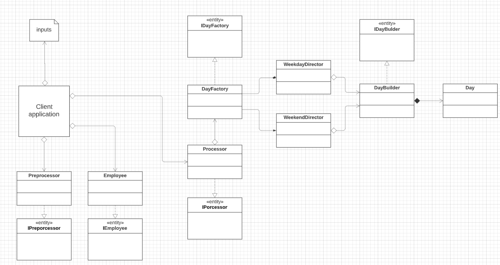

# ACME
ioet Position: Python Developer - Coding exercise
programming exercise to evaluate my skills in Python

# Components
The solution was proposed as shown in the following image:

  
   

We have a main module called ACME that will be the one that calls the rest of the actors involved in the solution. Internally we have two closely related modules, the first in charge of reading the information stored in the text file, once stored in a list, we proceed to interpret the information in the next module. 
The Worker module is divided into two stages, preprocessor and processor. The first sub-stage is in charge of validating the data that is being received, making sure that it maintains the correct structure, that the characters that compose it are the ideal ones and are in the corresponding position. An example data would be:
> SALO=TU10:00-12:00,TH01:00-03:00,SA12:00-18:00,SU15:00-21:00
Likewise, it is important to mention that the first two letters of each field separated by commas correspond to the first two letters of the respective day of the week.
MO: Monday
TU: Tuesday
WE: Wednesday
TH: Thursday
FR: Friday
SA: Saturday
SU: Sunday
The equal sign, the colon character and the hyphen were used, as well as the time format and the correct abbreviation of the day of the week.

once it has been validated that the data structure is correct, we move on to the second subsystem. The processor extracts the information and calculates when the employee should be paid. With the intention of demonstrating the handling of design patterns, classes and static modes, the design was carried out, which can be seen in the following UML diagram:

  
   

We have a client application, which in this case would be the acme.py file, which adds objects belonging to the class Preprocessor, processor, employee. In turn, the processor class adds a DayFactory object that allows creating an abstraction layer between the instance and the object, through the builder design pattern, in this case, different days of the week can be created composed of different hours of work of the three section available.

### how to run the application:
To avoid any kind of conflict with the python packages installed on the host, I created a virtual environment where I installed the dependencies I needed. In this particular case I used pipenv.

To install it, all you have to do is:
> python install pipenv
when the installation is ready, we run the virtual environment and then run the application.
#### run the virtual environment
> pipenv shell
#### run the application
> python ACME/lib/acme.py input.txt
